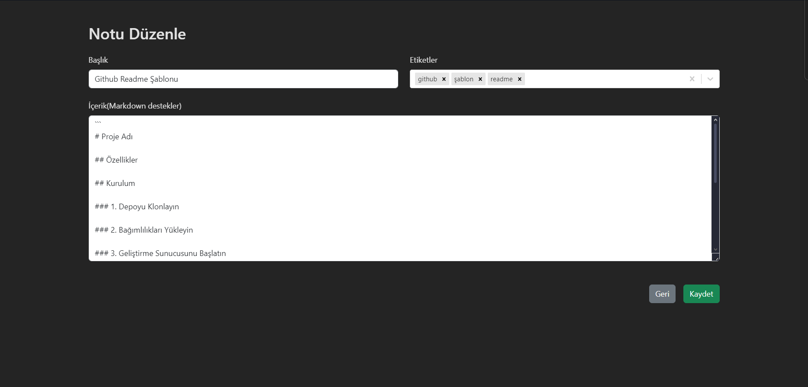

# Todo Uygulaması

Bu proje, React ve TypeScript ile oluşturulmuş ve Bootstrap ile stillendirilmiş bir **Todo Uygulamasıdır**. Kullanıcıların notlarını oluşturup yönetebileceği, görsellik açısından zengin bir uygulamadır.

## Özellikler

- **Not Yönetimi**:
  - Başlık, konu (Markdown desteği ile), ve etiketlerle not oluşturma.
  - Notları düzenleme ve silme.
- **Arama ve Filtreleme**:
  - Notları başlığa göre arama.
  - Etikete göre listeleme.
- **Markdown Desteği**:
  - [react-markdown](https://github.com/remarkjs/react-markdown) ile zengin metin düzenleme.
- **Seçim ve Animasyonlar**:
  - [react-select](https://react-select.com/) ile etiket seçimi.
  - [framer-motion](https://www.framer.com/motion/) ile kullanıcı dostu animasyonlar.

---

## Kurulum

Projeyi yerel ortamınıza klonladıktan sonra aşağıdaki adımları izleyin:

### 1. Depoyu Klonlayın

```bash
git clone https://github.com/cengo14/react-typsscript-todo-app-project.git
cd react-typsscript-todo-app-project
```

### 2. Bağımlılıkları Yükleyin

```bash
npm install
```

### 3. Geliştirme Sunucusunu Başlatın

```bash
npm run dev
```

Tarayıcınızda projeyi görmek için [http://localhost:5173](http://localhost:5173) adresini ziyaret edin.

---

## Kullanılan Teknolojiler

- **React** ve **TypeScript**
- **Bootstrap**: Şık ve duyarlı tasarımlar için.
- **react-markdown**: Markdown desteği için.
- **react-select**: Etiket seçimi için kullanıcı dostu bir bileşen.
- **framer-motion**: Akıcı ve etkileyici animasyonlar.

---

## Scriptler

Projede kullanabileceğiniz NPM scriptleri:

- **`npm run dev`**: Geliştirme sunucusunu başlatır.
- **`npm run build`**: Üretim için optimize edilmiş dosyaları oluşturur.
- **`npm run preview`**: Üretim çıktısını yerel olarak önizler.

---

## Katkıda Bulunma

1. Bu depoyu fork'layın.
2. Yeni bir dal oluşturun: `git checkout -b feature-isim`
3. Değişikliklerinizi yapın ve commitleyin: `git commit -m 'Yeni özellik eklendi'`
4. Dalınıza push yapın: `git push origin feature-isim`
5. Bir **Pull Request** açın.

---

## Lisans

Bu proje [MIT Lisansı](LICENSE) ile lisanslanmıştır.

---

## Ekran Görüntüleri

Uygulamanın ekran görüntülerini buraya ekleyebilirsiniz:



